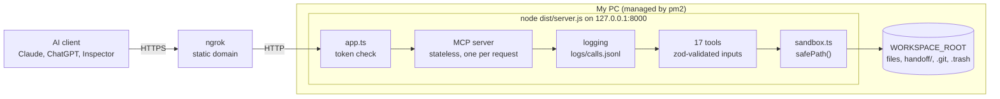

# MCP Workspace File Server

A sandboxed **MCP (Model Context Protocol) file server** in TypeScript. AI agents (Claude, ChatGPT and other MCP clients) use it to read, write, search and version files inside **one folder** on my PC, and to leave handoff notes so a later session can continue earlier work.

- **17 tools:** file operations, search, git-lite, and a session handoff protocol
- **Deployed:** HTTPS through an ngrok static domain, kept alive by pm2
- **Protected:** secret token (Bearer header or URL), every call logged, strict input validation
- **Stack:** Node.js, the official TypeScript MCP SDK, zod

Midterms Pt 1 (CS 3A / CS 3B): *Build your own MCP file-server connector.* **This README is the project's documentation and its short report** (see sections 7 and 8). All evidence is inside this repository, in [`evidence/`](evidence/).

## Contents

1. [Requirements and rubric coverage](#1-requirements-and-rubric-coverage)
2. [What to install](#2-what-to-install)
3. [Project structure](#3-project-structure)
4. [Project architecture](#4-project-architecture)
5. [Setup and usage](#5-setup-and-usage)
6. [Tools and handoff protocol](#6-tools-and-handoff-protocol)
7. [Report: security and sandboxing](#7-report-security-and-sandboxing)
8. [Report: tech stack and design choices](#8-report-tech-stack-and-design-choices)
9. [Demo and evidence](#9-demo-and-evidence)
10. [Troubleshooting](#10-troubleshooting)
11. [Limitations and stretch goals](#11-limitations-and-stretch-goals)

---

## 1. Requirements and rubric coverage

### Minimum requirements

| # | Requirement | How it is met | Where to look |
|---|---|---|---|
| 01 | Sandboxed workspace root; every path resolved against it; escapes rejected | `safePath()` resolves every path and rejects absolute paths, `..`, symlink escapes and reserved folders | `src/sandbox.ts`, `test/sandbox.test.ts` |
| 02 | At least 8 tools: file ops plus git-lite or search | 17 tools: 9 file/search, 3 git, 5 handoff | `src/tools/` |
| 03 | HTTPS through a tunnel, kept alive by a process manager | ngrok static domain; pm2 runs the server and the tunnel | `ecosystem.config.cjs`, section 5 |
| 04 | Handoff protocol: PROJECT_STATE, PLAN_LOG, CHECKPOINTS, DECISIONS | Four files managed only by the handoff tools | `src/tools/handoff.ts`, section 6 |
| 05 | Real MCP client, one multi-step task across 2 or more sessions | Demo with separate chats that share state only through the handoff files | `evidence/transcript.md`, section 9 |
| 06 | Short report: stack, tool design choices, security tradeoffs | Sections 7 and 8 of this README | this file |

### Rubric map (100 points)

| Criterion | Pts | Where the evidence is |
|---|---|---|
| **A** Agent efficiency | 20 | `evidence/transcript.md`, `evidence/PLAN_LOG.md`, `evidence/calls.jsonl`. Tools are built for few, small calls (chunked reads, `search_text`, `edit_file`, capped output) |
| **B** Agent and tool management | 20 | `evidence/PLAN_LOG.md`, `CHECKPOINTS.md`, `PROJECT_STATE.md`, `DECISIONS.md`, `calls.jsonl`; destructive tools gated and annotated (section 6) |
| **C** Tool design and implementation | 20 | `src/tools/` (zod schemas, `isError` messages), `evidence/inspector/` (MCP Inspector run), a real client in the transcript |
| **D** Tech stack and architecture | 15 | Sections 3, 4 and 8; `.env.example`; `ecosystem.config.cjs` |
| **E** Security and sandboxing | 10 | Section 7; `evidence/test-output.txt` (path and endpoint tests), the 401 check in section 5 |
| **F** Documentation, practice, demo | 15 | This README; the repository's git log; the live demo (section 9) |

---

## 2. What to install

### On your computer

| Install | Version | Why | Check it |
|---|---|---|---|
| [Node.js](https://nodejs.org) | 20.12 or newer (22 LTS recommended) | Runs the server and npm (uses `process.loadEnvFile`) | `node -v` |
| [git](https://git-scm.com) | any recent version | Git tools and checkpoints | `git --version` |
| [ngrok](https://ngrok.com) | account + agent | Public HTTPS tunnel. Claim a free **static domain** in the ngrok dashboard | `ngrok version` |
| [pm2](https://pm2.keymetrics.io) | any | Keeps the server and the tunnel running | `npm install -g pm2`, then `pm2 -v` |

Optional: the **MCP Inspector** for testing (no install, run it with `npx @modelcontextprotocol/inspector`).

### Project packages (installed by `npm install`)

| Package | Type | Why |
|---|---|---|
| `@modelcontextprotocol/sdk` | dependency | The official MCP SDK (server and Streamable HTTP transport) |
| `zod` | dependency | Validates every tool input |
| `typescript` | dev | Compiles `src/` to `dist/` |
| `tsx` | dev | Runs TypeScript directly for `npm run dev` |
| `vitest` | dev | Test runner |
| `@types/node` | dev | Node.js type definitions |

---

## 3. Project structure

```
mcp-files/
├── src/
│   ├── server.ts            Entry point: reads settings, checks the token, starts listening
│   ├── app.ts               HTTP app: token check, MCP server, logging, error handling
│   ├── sandbox.ts           ROOT folder and safePath(): the only door to the disk
│   ├── setup.ts             First-run setup: workspace .gitignore, git init, handoff files
│   ├── exportEvidence.ts    Copies the demo proof into evidence/ (npm run export-evidence)
│   ├── tool.ts              defineTool() helper and ToolError
│   ├── env.ts               Loads the .env file
│   └── tools/
│       ├── files.ts         9 file and search tools
│       ├── git.ts           3 git tools
│       ├── handoff.ts       5 session (handoff) tools
│       └── index.ts         The full list of 17 tools
├── test/
│   ├── setup.ts             Temporary workspace for the tests
│   ├── helpers.ts           call(): runs a tool the way the server does
│   ├── sandbox.test.ts      14 tests: sandbox, validation, destructive guards, handoff, git
│   └── auth.test.ts         9 tests: real HTTP + MCP, tokens, tool calls, errors, logging
├── evidence/                Proof of the demo (see section 9)
│   ├── PLAN_LOG.md          ┐
│   ├── CHECKPOINTS.md       │ copied from the workspace's handoff/ folder
│   ├── PROJECT_STATE.md     │ by npm run export-evidence
│   ├── DECISIONS.md         ┘
│   ├── git-log.txt          The workspace's commit history
│   └── workspace/           The files the agents made during the demo (a plain copy)
├── logs/                Proof of the demo (see section 9)
│   └── calls.jsonl          Every tool call the server handled
├── ecosystem.config.cjs     pm2 config: runs the server and the ngrok tunnel
├── package.json             Scripts: dev, build, start, test, export-evidence
├── tsconfig.json            Strict TypeScript settings
├── vitest.config.ts         Test settings
├── .env.example             Template for secrets (copy to .env, never commit .env)
└── .gitignore               Keeps .env, node_modules, dist, logs and workspace out of git
```

Created at runtime (not committed, on purpose):

```
dist/                        Compiled JavaScript (npm run build)
<WORKSPACE_ROOT>/            The only folder agents can touch (its own git repo)
├── handoff/                 PROJECT_STATE.md, PLAN_LOG.md, CHECKPOINTS.md, DECISIONS.md
├── .git/                    git history of the workspace (checkpoints)
└── .trash/                  Deleted files (recoverable)
```

The workspace is a separate git repo, so it cannot sit inside this repo: git would store only a pointer to it (an "embedded repository") and the files would never appear on GitHub. Plain copies of the demo's proof are therefore committed in `evidence/` with `npm run export-evidence`.

---

## 4. Project architecture



### How a request flows

1. The AI client sends an HTTPS request to the **ngrok static domain**.
2. ngrok forwards it to `127.0.0.1:8000`, where the Node server listens (pm2 keeps both processes alive).
3. **Token check (`app.ts`):** the request needs `Authorization: Bearer <MCP_TOKEN>` or the URL form `/<MCP_TOKEN>/mcp`. Otherwise the answer is `401`.
4. A fresh **MCP server** handles the request (stateless, so restarts never break a chat) and finds the tool.
5. **zod** validates the tool's inputs. Bad input is rejected before any tool code runs.
6. The call is **logged** to `logs/calls.jsonl`, whether it succeeds or fails.
7. The tool runs. Every file path goes through **`safePath()`**.
8. The result goes back to the client. Errors come back as `isError` with a short message, never a stack trace.

### The main pieces

| Piece | Responsibility |
|---|---|
| **ngrok** | Gives the local server a stable public HTTPS address |
| **pm2** | Restarts the server and the tunnel if they crash |
| **Token check** | Only requests that carry `MCP_TOKEN` get through |
| **Sandbox** | Agents can only touch `WORKSPACE_ROOT` |
| **Tools** | Small single-purpose actions with strict zod schemas |
| **Handoff files** | Shared memory between sessions: state, plan, checkpoints, decisions |
| **git** | Each checkpoint is a commit, so history shows who did what |

---

## 5. Setup and usage

### Step 1. Get the code and install packages

```bash
git clone <your-repo-url> mcp-files
cd mcp-files
npm install
```

### Step 2. Configure secrets

```bash
cp .env.example .env          # Windows: copy .env.example .env
```

| Variable | What to put |
|---|---|
| `MCP_TOKEN` | A long random secret, **at least 16 characters** (the server refuses to start otherwise). Make one: `node -e "console.log(require('crypto').randomBytes(32).toString('base64url'))"` |
| `WORKSPACE_ROOT` | A dedicated folder agents may use, for example `C:/Users/YOU/mcp-workspace`. The server creates it if it doesn't exist. Keep it **outside this repo**, and never use your whole user folder or `C:\`. Default is `./workspace` |
| `PORT` | `8000` (default) |
| `ALLOW_URL_TOKEN` | Optional, default `true`. Set to `false` to accept **only** the `Authorization: Bearer` header and reject the secret-in-URL form |

`.env` is never committed (it is listed in `.gitignore`).

### Step 3. Run locally and check the token gate

```bash
npm run dev
```

```
Workspace folder:  <your WORKSPACE_ROOT>
Bearer address:    http://127.0.0.1:8000/mcp   (header  Authorization: Bearer <MCP_TOKEN>)
URL-token address: http://127.0.0.1:8000/<MCP_TOKEN>/mcp
```

On first run the server creates the workspace, runs `git init` inside it, writes a `.gitignore` containing `.trash/`, and creates the four handoff files. In another terminal (replace `TOKEN`):

```bash
H='-H Content-Type:application/json -H Accept:application/json,text/event-stream'
B='{"jsonrpc":"2.0","id":1,"method":"tools/list"}'

curl -s -o /dev/null -w "%{http_code}\n" -X POST http://127.0.0.1:8000/mcp $H -d "$B"                                    # 401 (no token)
curl -s -o /dev/null -w "%{http_code}\n" -X POST http://127.0.0.1:8000/mcp $H -H "Authorization: Bearer wrong" -d "$B"   # 401
curl -s -X POST http://127.0.0.1:8000/mcp $H -H "Authorization: Bearer TOKEN" -d "$B"                                    # lists 17 tools (Bearer)
curl -s -X POST http://127.0.0.1:8000/TOKEN/mcp $H -d "$B"                                                               # lists 17 tools (URL token)
```

### Step 4. Run the tests

```bash
npm test
```

Expected: **23 passed** (14 sandbox/tool tests and 9 endpoint tests). The tests use a temporary workspace and never touch real files. Section 7 lists what they cover.

### Step 5. Test in the MCP Inspector

```bash
npx @modelcontextprotocol/inspector
```

Choose transport **Streamable HTTP**, URL `http://127.0.0.1:8000/mcp`, and in **Authentication** add the header `Authorization: Bearer <MCP_TOKEN>` (or use the URL `http://127.0.0.1:8000/<MCP_TOKEN>/mcp` with no header). Then **Connect -> Tools -> List Tools**. Call `list_files`, then try a bad input such as `read_file` with `../x` and confirm the clear error. Screenshots of this run are in `evidence/inspector/`.

### Step 6. Go public and keep it running

```bash
npm run build                                   # compiles src/ to dist/
ngrok config add-authtoken <YOUR_NGROK_AUTHTOKEN>
```

Edit `ecosystem.config.cjs` and put the static domain in `args`: `http --url=YOUR-DOMAIN.ngrok-free.app 8000`. Then:

```bash
pm2 start ecosystem.config.cjs
pm2 status                 # mcp-files and mcp-tunnel should both be "online"
pm2 save                   # remember the process list
```

pm2 restarts either process after a crash (`autorestart`, up to 20 restarts). To survive a reboot: on Mac/Linux run `pm2 startup` and follow its instructions; on Windows `pm2 startup` is not supported, so use a Task Scheduler task that runs `pm2 resurrect` at logon (or the `pm2-installer` package). After changing code: `npm run build && pm2 restart mcp-files`.

```bash
curl -s -o /dev/null -w "%{http_code}\n" https://YOUR-DOMAIN.ngrok-free.app/mcp   # 401 = reachable and protected
```

### Step 7. Connect an AI

In Claude: **Settings -> Connectors -> Add custom connector**:

```
https://YOUR-DOMAIN.ngrok-free.app/<MCP_TOKEN>/mcp
```

Claude's connector dialog does not offer a Bearer-header option on every account (it is rolling out gradually), so this uses the **secret-in-URL** form. If your dialog has **Request headers**, use `https://YOUR-DOMAIN.ngrok-free.app/mcp` with the header `Authorization: Bearer <MCP_TOKEN>` and set `ALLOW_URL_TOKEN=false`. Claude connects from Anthropic's cloud, so the public tunnel URL is required. Authentication settings can't be edited after a connector is added; to change the token or domain, remove the connector and add it again.

Other clients: ChatGPT (Developer Mode custom connector, no authentication, URL-token form) and developer tools such as Claude Code, Gemini CLI, Cursor and VS Code (Streamable HTTP, header or URL token).

Start each new chat with: *"Call start_session first, log_plan before multi-step work, and save_checkpoint at the end."* Not every client shows the server's built-in instructions to the model.

---

## 6. Tools and handoff protocol

Each tool is defined with `defineTool()`: a name, a description, a **zod schema** for the inputs, and a `run` function. The SDK validates every input against the schema before `run` is called, and the schema's descriptions are what the agent reads. Failures return `isError` with a short, actionable message; unexpected errors are replaced by a generic message, so no stack traces or file paths leak. Every tool carries MCP **annotations** (`readOnlyHint`, `destructiveHint`) so clients can tell read-only tools from tools that change or remove data.

### Files and search (9)

| Tool | What it does | Guard rails |
|---|---|---|
| `list_files(path, recursive)` | List a folder | Capped at 200 items; hides `.git` and `.trash`; does not follow symlinked folders |
| `read_file(path, start_line, max_lines)` | Read a chunk with `N: text` line numbers | Default 200 lines (max 1000), 20,000 char cap, says which `start_line` comes next |
| `write_file(path, content, overwrite)` | Create a file | Refuses to replace an existing file unless `overwrite=true` |
| `edit_file(path, old_text, new_text)` | Replace text (str_replace) | `old_text` must match **exactly once**; errors say how many matches were found |
| `delete_file(path, confirm)` | Delete a file or folder | Needs `confirm=true`; moves to `.trash/` with a timestamp (recoverable) |
| `rename_file(old_path, new_path)` | Rename or move | Both paths sandboxed; will not overwrite |
| `make_folder(path)` | Create folders | Sandboxed |
| `touch_file(path)` | Create an empty file or update its mtime | Sandboxed |
| `search_text(text, path, max_results)` | Case-insensitive search, returns `file:line: text` | Skips binary files, files over 1 MB and symlinks; stops at 50 results by default |

### Git-lite (3)

| Tool | What it does |
|---|---|
| `git_status()` | Short status and branch |
| `git_log(count)` | Recent commits: hash, author, date, message (1 to 100) |
| `git_commit(message, author)` | Commit everything, attributed to the agent's name |

### Handoff (5)

| Tool | What it does |
|---|---|
| `start_session(agent)` | **Call first.** Returns state, recent plan, latest checkpoint, recent decisions |
| `log_plan(agent, entry)` | Append one planned step to `PLAN_LOG.md` |
| `update_project_state(agent, content)` | Replace `PROJECT_STATE.md` with a current summary |
| `record_decision(agent, decision, reason)` | Append to `DECISIONS.md` |
| `save_checkpoint(agent, summary, next_steps, commit)` | Append to `CHECKPOINTS.md` and (by default) make a git commit |

The server's built-in `instructions` give every agent the efficient workflow: *start_session -> log_plan -> read before writing -> prefer edit_file over write_file -> search_text instead of reading many files -> save_checkpoint.* Every call is logged to `logs/calls.jsonl` (time, tool, arguments truncated to 100 chars, ok, error).

### Handoff protocol

Four files live in `WORKSPACE_ROOT/handoff/`:

| File | Behaviour | Purpose |
|---|---|---|
| `PROJECT_STATE.md` | Replaced | Where the project is now: goal, done, in progress, next, blockers |
| `PLAN_LOG.md` | Append-only | One line per intended step, with time and agent |
| `CHECKPOINTS.md` | Append-only | One section per finished chunk of work, plus **Next:** |
| `DECISIONS.md` | Append-only | Choices and the reason for each |

**Protocol.** A new session calls `start_session` and resumes from what it reads. During work it calls `log_plan` before multi-step tasks and `record_decision` for important choices. It finishes with `save_checkpoint` (which also commits) and updates `PROJECT_STATE`.

**Why agents can't corrupt it.** The normal file tools refuse any path under `handoff/`, so the notes change only through the handoff tools. The append-only files can't be wiped by an agent, and each checkpoint is also a git commit. The `agent` argument ("planner", "coder", ...) is recorded on every entry, is limited to letters, numbers, space, `.`, `_` and `-` (max 40), and plan and decision notes are collapsed to one line, so a note can't forge extra log lines.

**Roles.** Roles are a convention: each agent names itself ("planner", "coder") and the files record who did what. Tool access is not scoped per role (see section 11).

---

## 7. Report: security and sandboxing

### Sandbox (`src/sandbox.ts`, `safePath`)

Every tool resolves its paths through `safePath()` before touching the disk:

1. Absolute paths (`/etc/passwd`, `C:\...`, `\\server\share`) are rejected.
2. The path is joined to `WORKSPACE_ROOT` and resolved: `..` is collapsed, and symlinks are followed even for a file that does not exist yet (the deepest existing parent is resolved), so a new file can't be created through a link that points outside.
3. The resolved path must still be inside the root, otherwise: *"is outside the workspace"*.
4. `.git` and `.trash` are reserved and unreachable.
5. For anything that changes files: the root itself can't be modified, and `handoff/` is protected.

### Endpoint authentication

A request must carry `MCP_TOKEN` in one of two ways, otherwise the server returns `401` with `WWW-Authenticate: Bearer`:

| Method | Looks like | When to use |
|---|---|---|
| **Bearer header** (preferred) | `POST /mcp` + `Authorization: Bearer <MCP_TOKEN>` | Any client that can send headers (Inspector, curl, scripts, developer tools). The secret stays out of URLs and access logs |
| **Secret in the URL** | `POST /<MCP_TOKEN>/mcp` | Clients that can't send headers, such as Claude's connector dialog on accounts without a Request headers option |

Both comparisons are constant time (SHA-256 of each side, then `crypto.timingSafeEqual`). `ALLOW_URL_TOKEN=false` turns the URL form off. The server refuses to start with a token shorter than 16 characters, the token comes from the environment and never from code, and request bodies are capped at 1 MB.

### Destructive actions

Overwrites need `overwrite=true`; deletes need `confirm=true` and are recoverable from `.trash/`; handoff notes are append-only; every call (success or failure) is logged; git history records every checkpoint; destructive tools are marked with `destructiveHint` so clients can ask for approval.

### Tests (23, `npm test`; output in `evidence/test-output.txt`)

| Area | Test |
|---|---|
| Path traversal | `..`, `a/../../x`, `a/../../../etc/passwd` all blocked |
| Absolute paths | POSIX, drive-letter and UNC paths blocked |
| Symlink escape | A link to a file, a link to a folder, and creating a new file through a folder link are all blocked |
| Reserved folders | `.git` can't be listed |
| Handoff protection | Write and delete under `handoff/` blocked |
| Destructive gating | No accidental overwrite; delete needs `confirm=true` and lands in `.trash` |
| Edit safety | Zero or multiple matches rejected; `$` in new text stays literal |
| Input validation | zod rejects missing, out-of-range and badly formatted inputs |
| Other tools | rename, touch, make_folder (including rename to `../`), search, list |
| Protocol | Two-session handoff, forged-line prevention, git checkpoint commit |
| Endpoint auth (real HTTP) | No token, wrong URL token, wrong or malformed Bearer -> 401 with `WWW-Authenticate: Bearer`; correct Bearer and correct URL token -> 17 tools listed; URL token can be switched off |
| End-to-end MCP | A real tool call works; a sandbox error returns `isError` with no stack trace; every call is written to the log; wrong method, path or body is refused (405, 404, 400) |

### Threats and tradeoffs

| Threat | Status | Notes |
|---|---|---|
| Path traversal / symlink escape | Mitigated | Resolve + root check, covered by tests |
| Anyone finding the URL | Mitigated | Secret token, constant-time compare, 401 otherwise |
| **Token leakage** | **Reduced, one accepted risk** | Bearer-header auth keeps the secret out of URLs and logs. The URL-token form (needed for Claude's connector dialog when it has no header option) can leak into client history, proxy logs and the ngrok inspector. Mitigations: long random token, `ALLOW_URL_TOKEN=false` when headers are available, rotate the token if it leaks |
| Information leaks in errors | Mitigated | Only `ToolError` messages reach the agent; anything else becomes "Unexpected server error." |
| Command injection through git | Mitigated | `execFileSync` with an argument list, no shell; agent names are restricted by a zod regex |
| Log or note forging | Mitigated | Agent names restricted, notes collapsed to one line |
| Host header attacks | Accepted | No Host check; the token check replaces it, and the server binds to `127.0.0.1` only |
| Prompt-injected agent deleting or overwriting | Reduced | Confirm/overwrite flags, trash instead of hard delete, logs, git history |
| Secrets inside the workspace | Accepted | `git_commit` stages everything. Don't keep secrets in `WORKSPACE_ROOT` |
| Brute force / abuse | Not mitigated | No rate limiting. The token is long and random; ngrok can add limits |
| Race between check and use (TOCTOU) | Accepted | Single-user local use |

---

## 8. Report: tech stack and design choices

### Stack

| Layer | Choice | Why | Alternatives |
|---|---|---|---|
| Runtime and SDK | Node.js + official TypeScript MCP SDK | The course reference stack; types catch mistakes at build time | Python with the official SDK or FastMCP |
| Transport | Streamable HTTP, stateless (a new MCP server per request, JSON responses) | Works through a tunnel, and a restart never breaks an existing chat | stdio (local only) or stateful sessions |
| HTTP layer | Plain `node:http` | The SDK transport accepts Node requests directly, so no Express dependency | Express |
| Validation | zod schema on every tool input | Bad input is rejected before any tool code runs, and the schema doubles as documentation for the agent | Manual checks |
| Exposure | ngrok with a static domain | Stable URL, so the connector survives restarts | Cloudflare Tunnel, small VPS |
| Process manager | pm2 managing **both** the server and the tunnel | One tool keeps both alive and restarts them after crashes | systemd or Docker |
| Version control | git CLI on the host, called with argument lists | Simple "git-lite" and checkpoint commits | A git library |
| Config | Environment variables from `.env` (`process.loadEnvFile`) | No hardcoded secrets, and no dotenv dependency | dotenv |
| Testing | vitest, MCP Inspector, then a real client | Matches the reference approach | Scripted JSON-RPC only |

### Tool design choices

- **Single-purpose tools with strict schemas.** Each tool does one thing and every argument has a description, so the agent can't guess wrongly about what it does.
- **Built for efficiency.** Reads are chunked, with a hint for the next `start_line`; lists and searches are capped; `search_text` replaces reading many files; `edit_file` replaces rewriting whole files; and `write_file` refuses to overwrite by accident.
- **Errors that teach.** Every error says what to do next ("Use edit_file for small changes, or set overwrite=true").
- **Destructive actions gated.** `delete_file` needs `confirm=true` and moves files to `.trash/`; clients also see `destructiveHint`.
- **Handoff through dedicated tools, not plain files.** Agents can't overwrite the notes by accident, and append-only logs keep the history honest.
- **One MCP server per request.** Stateless handling removes session bookkeeping and makes restarts invisible to chats.
- **Two auth forms.** A Bearer header is better, but not every client can send one, so the URL form stays available and can be switched off.

---

## 9. Demo and evidence

All evidence is in [`evidence/`](evidence/) inside this repository (see [`evidence/README.md`](evidence/README.md)).

### The demo

Goal: one multi-step task finished across 2 or more separate sessions, with context carried only by the handoff files.

1. `pm2 status` shows both processes online and the connector is connected.
2. **Session 1 (planner):** a new chat gets a multi-step task, for example *"Build a small notes app plan in the workspace: create the project folder structure and a README, record the stack decision, and checkpoint when done."* The agent calls `start_session`, `log_plan`, creates files, `record_decision`, and `save_checkpoint`.
3. **Session 2 (coder):** a **new** chat (it can be a different AI client) is told *"Continue the project."* It calls `start_session`, resumes from the checkpoint without being re-briefed, finishes the next steps and checkpoints again.

### Evidence in the repo

| File or folder | What it shows | Rubric |
|---|---|---|
| `evidence/transcript.md` | Tool-call transcript of the demo across the sessions, with a note on any errors and how the agent recovered | A, C |
| `evidence/PLAN_LOG.md` | What each agent planned to do, with time and agent name | A, B |
| `evidence/CHECKPOINTS.md` | Finished work and the next steps handed to the following session | B |
| `evidence/PROJECT_STATE.md`, `DECISIONS.md` | Final project state and the choices made | B |
| `evidence/calls.jsonl` | Every tool call the server handled, including errors | A, C |
| `evidence/git-log.txt` | The workspace's commit history (one commit per checkpoint, author = agent) | B |
| `evidence/workspace/` | The files the agents made during the demo | A |
| `evidence/inspector/` | MCP Inspector screenshots: tools list, a successful call, a refused call | C |
| `evidence/test-output.txt` | Output of `npm test` (path traversal and endpoint tests) | E |

### How the evidence was produced

1. Run the demo above.
2. Paste the transcript into `evidence/transcript.md`.
3. Run `npm run export-evidence`. It copies the four handoff files, `logs/calls.jsonl`, the workspace's `git log`, and a snapshot of the agents' files into `evidence/`.
4. Run `npm test` and save the output to `evidence/test-output.txt`; save the Inspector screenshots to `evidence/inspector/`.
5. Commit with `git add evidence && git commit`.

### Live demo (5 minutes)

Show `pm2 status`, run Session 2 live (it picks up Session 1's work), then show the path-escape error and the 401 on a bad token.

---

## 10. Troubleshooting

| Symptom | Cause and fix |
|---|---|
| `ERR_NGROK_3200` | The tunnel endpoint is offline: no ngrok agent is serving that domain. Check `pm2 status` for `mcp-tunnel`, and that the `--url` domain matches the one in the connector |
| `401` from the public URL | Missing or wrong token. Use `https://DOMAIN/<MCP_TOKEN>/mcp`, or `https://DOMAIN/mcp` with `Authorization: Bearer <MCP_TOKEN>` (the word `Bearer` and a space are required). If `ALLOW_URL_TOKEN=false`, the URL form is rejected. Restart the server after editing `.env` |
| 502 / connection refused | Server not running, or ngrok points at the wrong port. The port in `.env`, `ngrok http ... <PORT>` and `ecosystem.config.cjs` must match |
| "Set MCP_TOKEN (at least 16 characters)" | Missing or short token. Generate one and put it in `.env` |
| `Cannot find module dist/server.js` (pm2) | Not built yet. Run `npm run build` |
| Code change has no effect under pm2 | pm2 runs the compiled `dist/`. Run `npm run build && pm2 restart mcp-files` |
| `process.loadEnvFile is not a function` | Node is too old. Install 20.12 or newer (22 LTS recommended) |
| `export-evidence` says "skipped ... not found" | The demo hasn't run yet, or `WORKSPACE_ROOT` in `.env` points at a different folder than the one the server used |
| "git is not installed" | git is missing from your PATH. Install git and restart the server |
| Tools missing in Claude after a change | The connector keeps its saved URL. Remove and re-add the connector |
| New chat can't see tools | The connector is not enabled for that chat. Enable it in the chat's tools menu |

---

## 11. Limitations and stretch goals

- **Roles are by convention.** Every agent sees all 17 tools; the `agent` argument labels who did what, but tool access is not scoped per role. A scoped version would run a second, read-only server (or token) for reviewer-style agents.
- **Single shared token** for every agent. Both auth forms use the same `MCP_TOKEN`, and the URL form can leak (see the threats table). OAuth would remove both limits but is out of scope here.
- **No rate limiting** on the public endpoint.
- **Stretch goals:** token auth is implemented (Bearer header and URL secret). `if_version` locking, `search_code` and a repo map are not.
